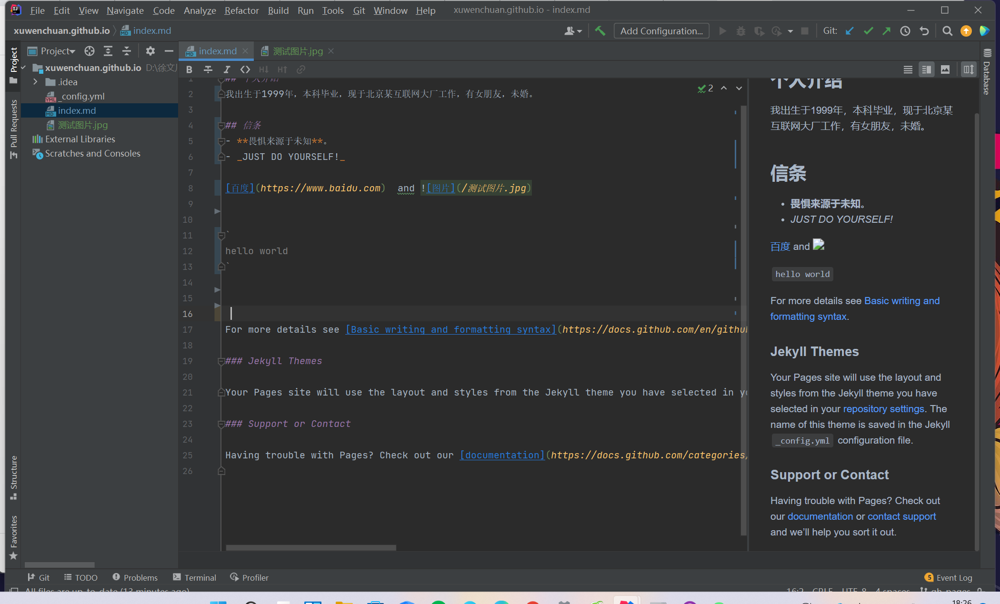

## 个人介绍

我出生于1999年，本科毕业，现于北京某互联网大厂工作，有女朋友，未婚。

## 信条

- **畏惧来源于未知**。
- _JUST DO YOURSELF!_

[百度](https://www.baidu.com)  and 

`
hello world
`

For more details
see [Basic writing and formatting syntax](https://docs.github.com/en/github/writing-on-github/getting-started-with-writing-and-formatting-on-github/basic-writing-and-formatting-syntax)
.

### Jekyll Themes

Your Pages site will use the layout and styles from the Jekyll theme you have selected in your [repository settings](https://github.com/git-lover123/xuwenchuan.github.io/settings/pages). The name of this theme is saved in the Jekyll `_config.yml` configuration file.

### Support or Contact

Having trouble with Pages? Check out our [documentation](https://docs.github.com/categories/github-pages-basics/) or [contact support](https://support.github.com/contact) and we’ll help you sort it out.
